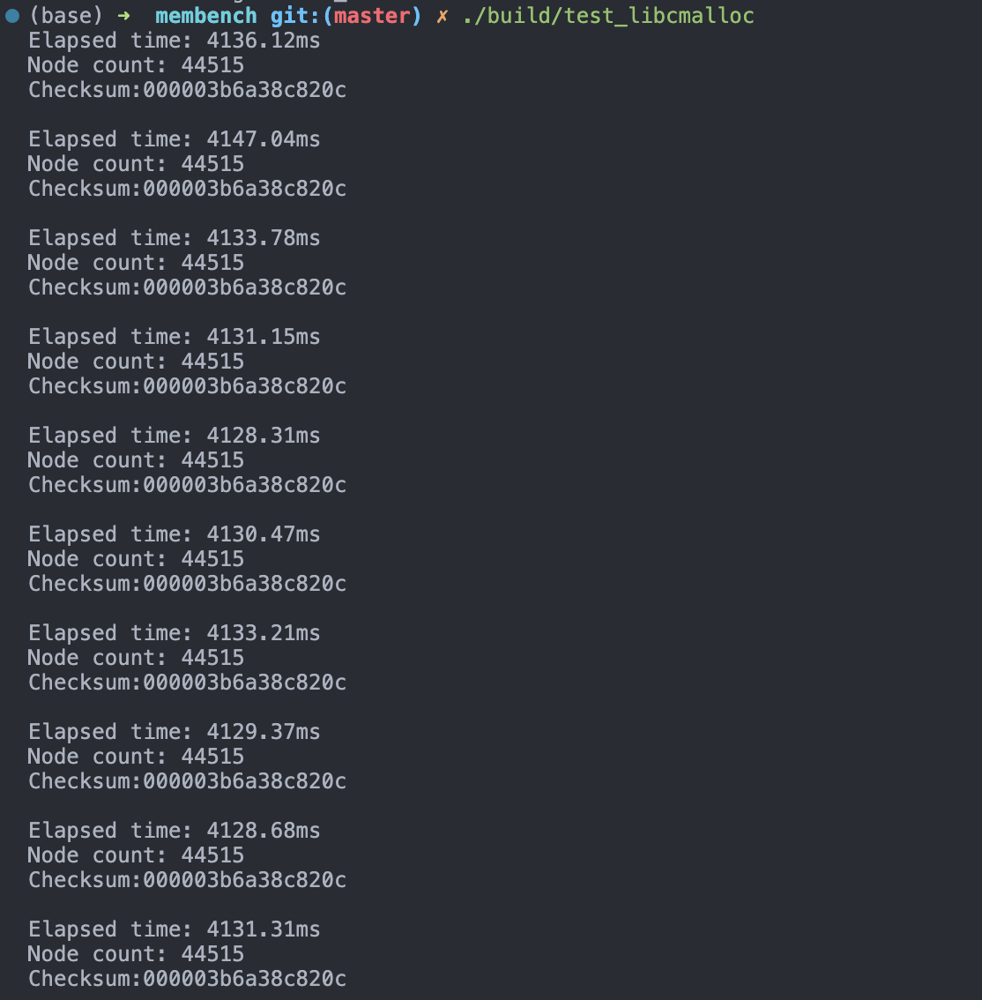
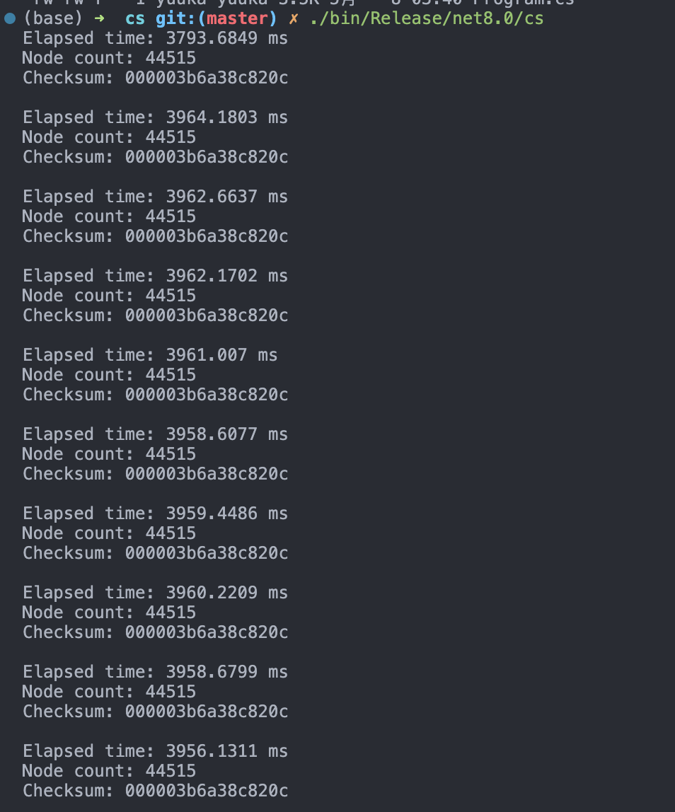

# 内存分配性能测试

[知乎原帖](https://zhuanlan.zhihu.com/p/696063514?utm_campaign=&utm_medium=social&utm_psn=1771194604794503170&utm_source=qq)


只复现了C++和C#，java有空再补充


## 测试平台

操作系统和gcc，glibc版本2.31

```shell
# uname -a
Linux pc3 5.15.0-105-generic #115~20.04.1-Ubuntu SMP Mon Apr 15 17:33:04 UTC 2024 x86_64 x86_64 x86_64 GNU/Linux

# gcc -v                          
Using built-in specs.
COLLECT_GCC=gcc
COLLECT_LTO_WRAPPER=/usr/lib/gcc/x86_64-linux-gnu/9/lto-wrapper
OFFLOAD_TARGET_NAMES=nvptx-none:hsa
OFFLOAD_TARGET_DEFAULT=1
Target: x86_64-linux-gnu
Configured with: ../src/configure -v --with-pkgversion='Ubuntu 9.4.0-1ubuntu1~20.04.2' --with-bugurl=file:///usr/share/doc/gcc-9/README.Bugs --enable-languages=c,ada,c++,go,brig,d,fortran,objc,obj-c++,gm2 --prefix=/usr --with-gcc-major-version-only --program-suffix=-9 --program-prefix=x86_64-linux-gnu- --enable-shared --enable-linker-build-id --libexecdir=/usr/lib --without-included-gettext --enable-threads=posix --libdir=/usr/lib --enable-nls --enable-clocale=gnu --enable-libstdcxx-debug --enable-libstdcxx-time=yes --with-default-libstdcxx-abi=new --enable-gnu-unique-object --disable-vtable-verify --enable-plugin --enable-default-pie --with-system-zlib --with-target-system-zlib=auto --enable-objc-gc=auto --enable-multiarch --disable-werror --with-arch-32=i686 --with-abi=m64 --with-multilib-list=m32,m64,mx32 --enable-multilib --with-tune=generic --enable-offload-targets=nvptx-none=/build/gcc-9-9QDOt0/gcc-9-9.4.0/debian/tmp-nvptx/usr,hsa --without-cuda-driver --enable-checking=release --build=x86_64-linux-gnu --host=x86_64-linux-gnu --target=x86_64-linux-gnu
Thread model: posix
gcc version 9.4.0 (Ubuntu 9.4.0-1ubuntu1~20.04.2) 
```

内存金士顿银爵DDR4 32G*4，cpu为13th Gen Intel(R) Core(TM) i5-13490F

## 构建

- C++的benchmark构建和运行 （[需要安装vcpkg](https://learn.microsoft.com/en-us/vcpkg/get_started/get-started?pivots=shell-bash)），使用的mimalloc版本为2.1.2

  ```shell
  cmake --preset=default -DCMAKE_BUILD_TYPE=Release
  
  cmake --build build
  
  #测试libc的malloc
  ./build/test_libcmalloc
  
  #测试mimalloc
  ./build/test_mimalloc
  ```

- C#的benchmark构建和运行（代码在cs目录下，先进入cs目录），[Linux下安装.net SDK](https://learn.microsoft.com/zh-cn/dotnet/core/install/linux-ubuntu-install?pivots=os-linux-ubuntu-2004&tabs=dotnet8)

  ```shell
  dotnet build -c Release
  
  #运行
  ./bin/Release/net8.0/cs
  ```

  

## 运行结果

- C++（libc的malloc）

- C++（mimalloc）

  

- C#（只使用了-c Release构建）

  